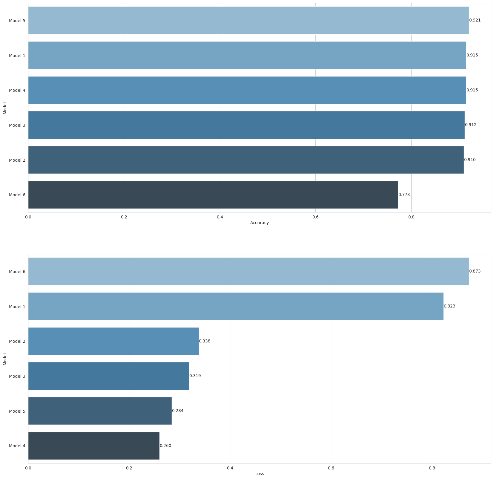

# Image-Classification-with-CNN

# Dataset Info

This is image classifier with Convolutional Neural Networks for the Fashion MNIST dataset. This data set includes 10 labels of different clothing types with 28 by 28 <b>grayscale</b> images. There is a training set of 60,000 images and 10,000 test images.

### Labels	Description: :
 
    | Label    | Description   |
    | :---: | :---: |
    | 0   | `' T-shirt/top'`   |
    | 1   | `'Trouser'` |
    | 2   | `'Pullover'` |
    | 3   | `'Dress'` |
    | 4   | `'Coat'` |
    | 5   | `'Sandal'` |
    | 6   | `'Shirt'` |
    | 7   | `'Sneaker'` |
    | 8   | `'Bag'` |
    | 9   | `'Ankle boot'` |
    
# Tasks: ⚙️

#### 1. Import Libraries

#### 2. Recognizing and Understanding Data

#### 3. Data Preprocessing
  
#### 4. Modelling & Model Performance

#### 5. Compare Models

#### 6. Prediction

## Used Libraries 📚
- `numpy`- `pandas`- `matplotlib`- `seaborn` - `sklearn`- `tensorflow` - `optuna`  - `keras` - `regularizers`

  
## Run the project ⚙️
The repository includes a Jupyter notebook which you can run on your local machine or use this  link.

## Results 🪄

The above image demonstrates that the model 5 got good scores outperforming the other models.

### Optimal Hyperparameters for model 5:
 
| Layer     | Output Shape   | Param # | 
| :---: | :---: | :---: |
| conv2d_22 (Conv2D)   | (None, 26, 26, 28)  | 280 |
| batch_normalization_22 (BatchNormalization)   | (None, 26, 26, 28) | 112 |
| ax_pooling2d_22 (MaxPooling2D)    | (None, 25, 25, 28) | 0 |
| dropout_22 (Dropout)   | (None, 25, 25, 28) | 0 |
| conv2d_23 (Conv2D)   | (None, 23, 23, 48) | 12144   |
| batch_normalization_23 (BatchNormalization)   | (None, 23, 23, 48) |192    |    
| max_pooling2d_23 (MaxPooling2D)   | (None, 22, 22, 48) |0 |
| dropout_23 (Dropout)   |(None, 22, 22, 48) |0 |
| flatten_11 (Flatten)   | (None, 23232)  | 0 |
| dense_33 (Dense)   | (None, 128) | 2973824 |
| dense_34 (Dense)   | (None, 64) | 8256  |    
| dense_35 (Dense)   | (None, 10) | 650 |      

- Total params: 2995458 (11.43 MB)
- Trainable params: 2995306 (11.43 MB)
- Non-trainable params: 152 (608.00 Byte)

## Acknowledgements
This project is part of ML bootcamp provided by <a href="https://clarusway.com/"> Clarusway</a>.

